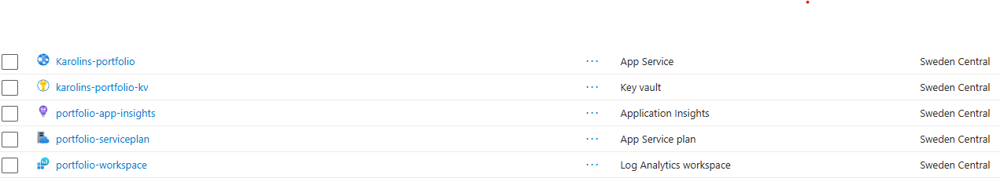
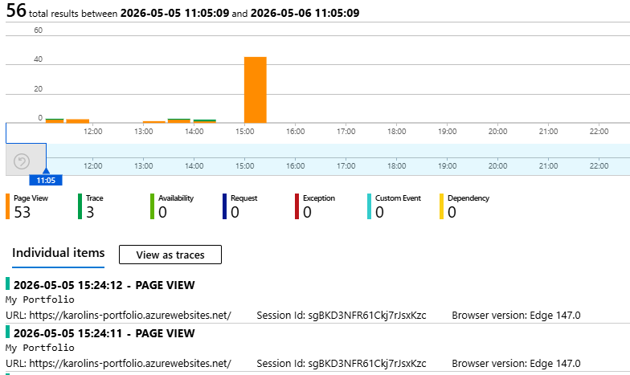

# Terraform Azure Portfolio

Terraform configuration for deploying my portfolio web app on Azure using Docker and nginx, with Application Insights for client-side monitoring, Azure Monitor for alerts and autoscaling, and Azure Key Vault for secret management.

## Project Setup

Terraform project files were generated using a custom bash script:

```bash
create-terraform.sh project-name
```

The script creates `main.tf`, `variables.tf`, `terraform.tfvars` and `outputs.tf` automatically.

## Infrastructure

- Azure App Service Plan (Linux, B1)
- Azure Linux Web App running a Docker container from Docker Hub
- Log Analytics Workspace
- Application Insights for client-side monitoring
- Azure Monitor Metric Alert for page view notifications
- Azure Monitor Autoscale 
- Azure Key Vault for secret management



## Monitoring

Application Insights is configured for client-side monitoring using the JavaScript SDK.

Tracks:
- Page views
- JavaScript errors
- Page load performance



## Alerts

Azure Monitor Metric Alert is configured to trigger when page views exceed 10 within 5 minutes, sending an email notification.

## Autoscaling

Azure Monitor Autoscale is configured to scale up by 1 instance when CPU exceeds 50% over a 5 minute window, with a maximum of 2 instances. Sends email notification when triggered. 

> Note: For a static nginx portfolio, CPU-based autoscaling will rarely trigger in practice as nginx handles static files with minimal CPU usage. 

## Security

Azure Key Vault is used to store the Application Insights instrumentation key securely. Access is managed via system-assigned managed identity, eliminating the need for hardcoded credentials.

## Prerequisites

- WSL (Windows Subsystem for Linux) with Ubuntu
- Terraform installed
- Azure CLI installed and logged in (`az login`)
- Docker Hub account with a pushed image

## Usage

1. Clone the repository
2. Copy and fill in the variables:
```bash
   cp terraform.tfvars.example terraform.tfvars
```
3. Initialize Terraform:
```bash
   terraform init
```
4. Plan and apply:
```bash
   terraform plan
   terraform apply
```

## Destroy infrastructure

```bash
terraform destroy
```
